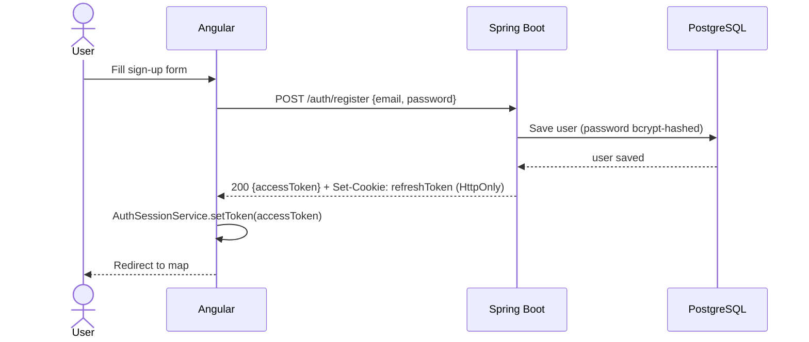
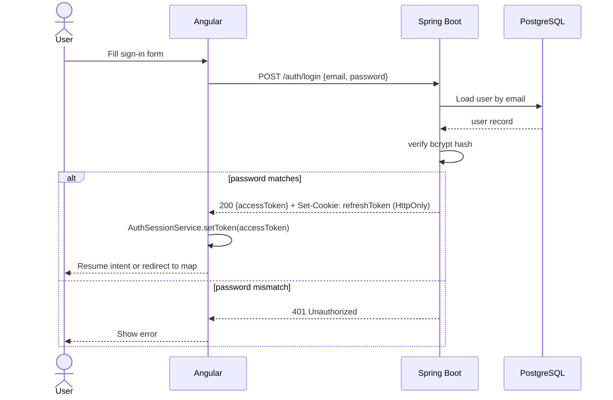
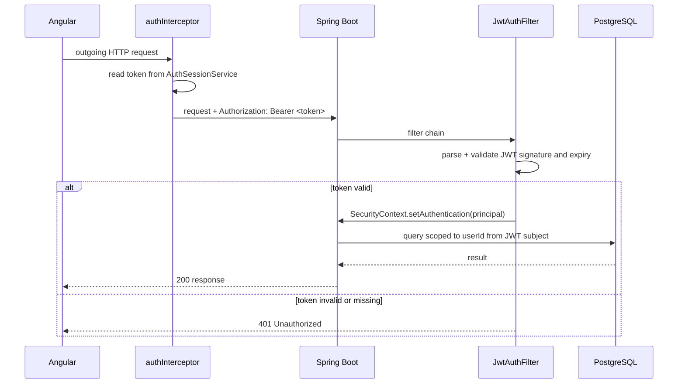

# Auth Sequence Diagram

Three flows:

1. **Register** — new user signs up, receives tokens
2. **Login** — existing user authenticates, receives tokens
3. **Authenticated request** — token is attached and validated per request

---

## 1. Register

---

## 2. Login

---

## 3. Authenticated Request

