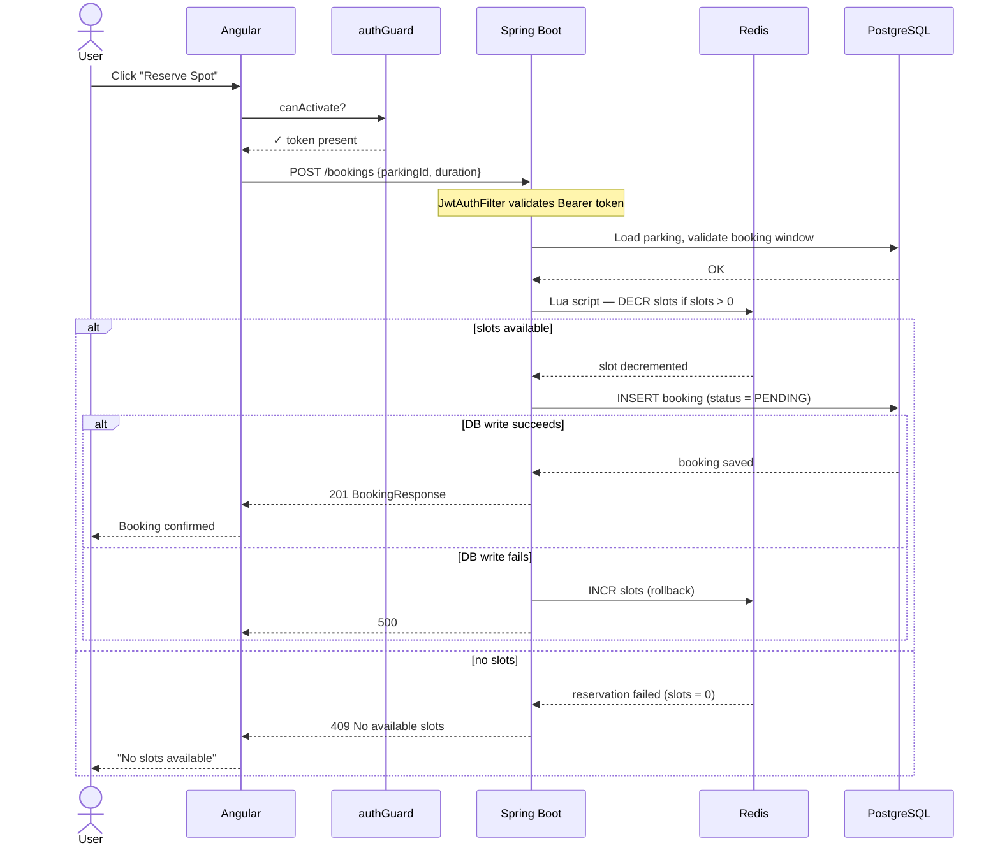
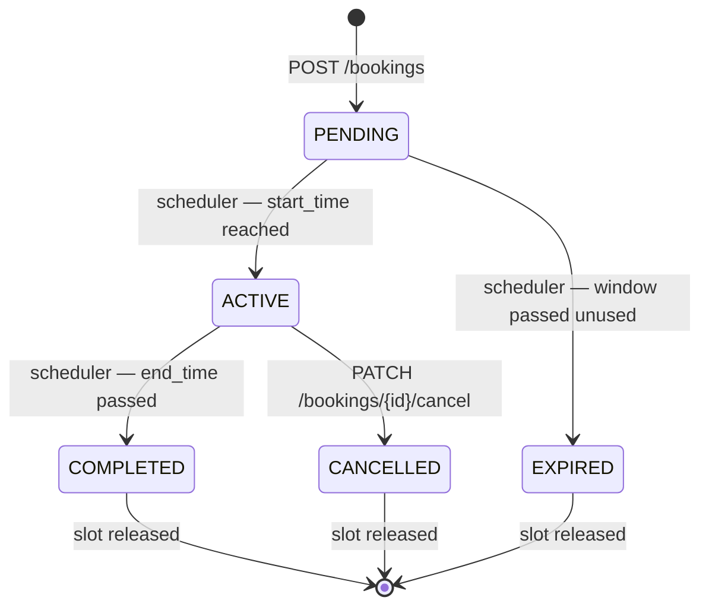

# Booking Sequence Diagram

Two diagrams:

1. **Booking creation** — including race condition protection via Redis atomic reservation
2. **Booking lifecycle** — state machine driven by a background scheduler

---

## 1. Booking Creation

---

## 2. Booking Lifecycle

Driven by `BookingLifecycleScheduler` — runs every 60 seconds.

Terminal states (COMPLETED, CANCELLED, EXPIRED) trigger a Redis slot restore (`INCR`).
