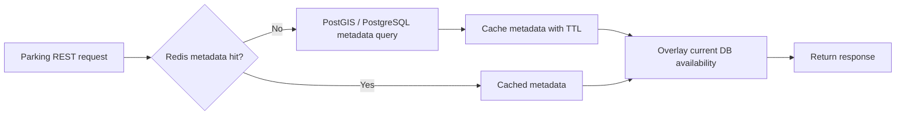
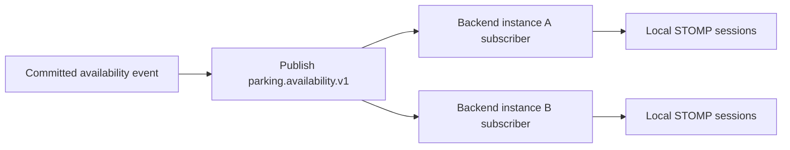

# Redis Flow

Redis serves four supporting roles in Parking Finder. PostgreSQL remains the durable source of
truth for every business-critical value.

---

## Role 1: Static Metadata Cache

Nearby and detail responses use cache-aside storage to reduce repeated metadata work.



Availability is not trusted from the metadata cache. Every REST response overlays a small current
PostgreSQL projection containing parking ID, available slots, total slots, and `updatedAt`.

---

## Role 2: Atomic Booking and ENTER Admission

A Lua script serializes competing reservations before PostgreSQL applies its final guarded update.

```text
GET parking:{id}:slots
  → initialize from DB-derived fallback if missing
  → if value <= 0, reject
  → otherwise DECR atomically
```

PostgreSQL still enforces `0 <= available_slots <= total_slots`. If its transaction rejects or
rolls back, the Redis reservation is compensated. This makes Redis a fast admission gate, not the
authority.

---

## Role 3: Absolute Availability Projections

After a committed change, the projection updater writes:

| Key | Value |
|-----|-------|
| `parking:{id}:slots` | Absolute available-slot counter |
| `parking:{id}:availability` | JSON snapshot with slots, capacity, and timestamp |

It also evicts `parking:detail:{id}`. Absolute values are safe to apply more than once and recover
counter drift caused by an earlier partial failure.

---

## Role 4: Cross-Instance Pub/Sub



The publishing instance consumes its own Redis message, so every browser uses the same
subscriber-to-STOMP path. Pub/Sub is non-durable: disconnected subscribers receive no replay.
Angular recovers through REST polling while realtime is unavailable and an immediate REST resync
after reconnect.

---

## Failure Boundaries

- Redis admission failure fails booking or `ENTER` closed with HTTP 503.
- PostgreSQL rejection compensates the Redis reservation.
- Redis projection or Pub/Sub failure occurs after commit, is logged, and cannot roll back the
  durable database change.
- A stale or duplicate browser event cannot reduce correctness because events are absolute and the
  client rejects older `updatedAt` values.
