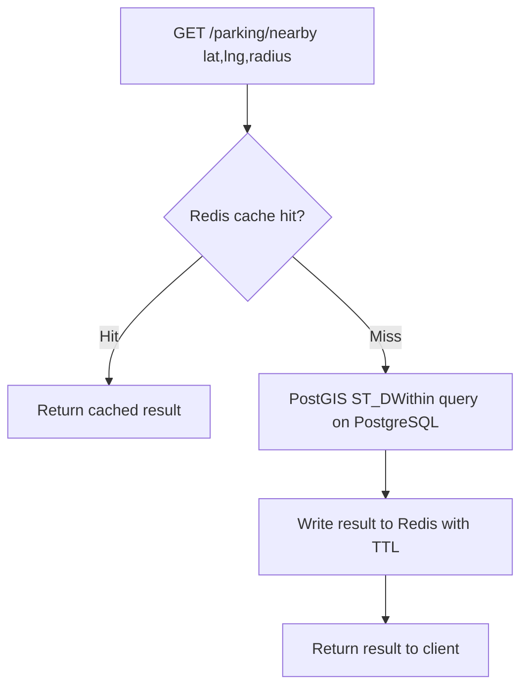
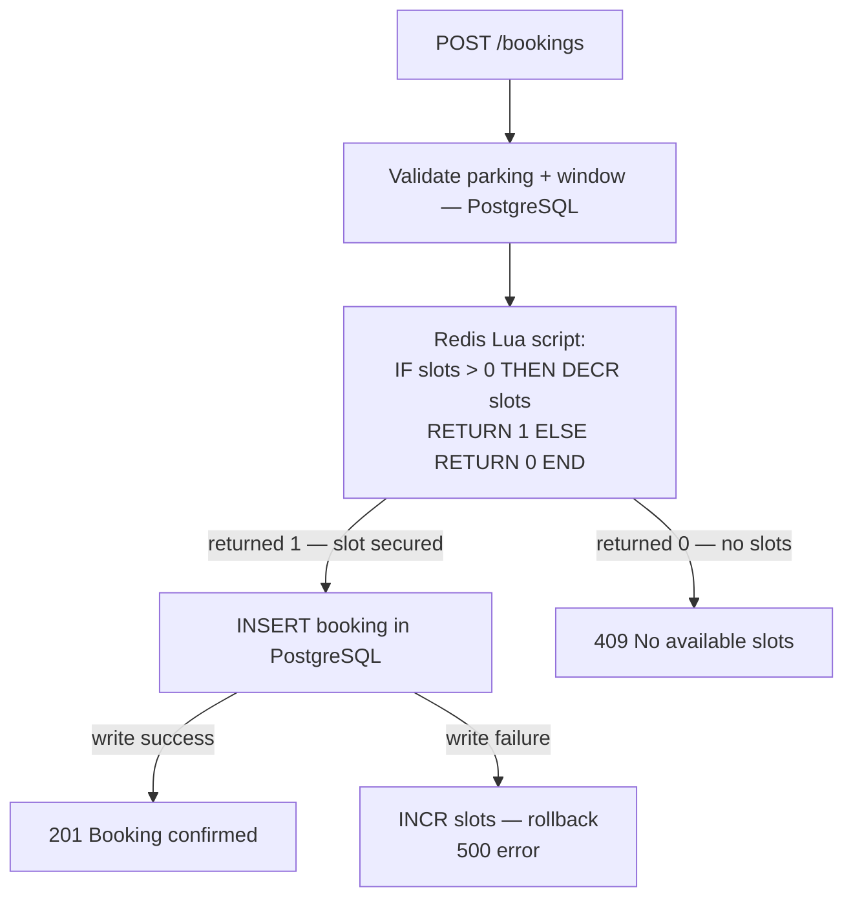

# Redis Flow

Redis serves two distinct roles in Parking Finder.

Redis is **never** the source of truth. PostgreSQL is.

---

## Role 1: Cache-Aside for Parking Search

Reduces database load for the most frequent read path: nearby parking queries.



**Trade-off accepted:** Cache may return slightly stale slot counts.
Acceptable because parking search is a discovery flow, not a reservation commitment.

---

## Role 2: Atomic Slot Reservation for Booking

Prevents overselling when multiple users try to book the last available slot simultaneously.



### Why a Lua Script?

Redis commands are single-threaded. A Lua script runs atomically — no other command can execute between the check and the decrement.

Without atomicity:

```
User A: GET slots → 1
User B: GET slots → 1
User A: DECR slots → 0  ✓
User B: DECR slots → -1 ✗  (oversold)
```

With Lua script — this race condition is impossible.

---

## Slot Counter Lifecycle

Slot counters are seeded from PostgreSQL on startup and updated by:

| Event | Redis Operation |
|-------|----------------|
| Booking created | `DECR parking:{id}:slots` |
| Booking cancelled | `INCR parking:{id}:slots` |
| Booking completed | `INCR parking:{id}:slots` |
| Booking expired | `INCR parking:{id}:slots` |
| DB write failure | `INCR parking:{id}:slots` (rollback) |
