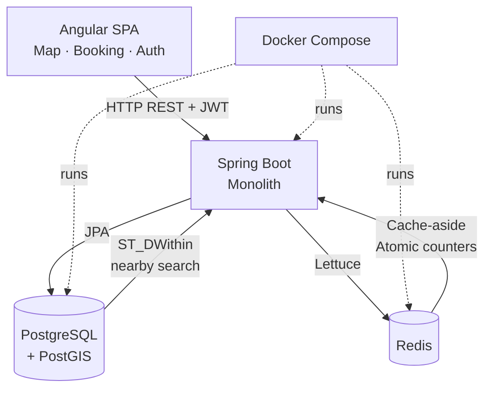

# System Overview

High-level view of Parking Finder's components, data flows, and security model.

---

## Components

| Layer | Technology | Role |
|-------|-----------|------|
| Frontend | Angular SPA | Map-first UI, booking and auth flows |
| Backend | Spring Boot (monolith) | REST API, business logic, scheduled jobs |
| Database | PostgreSQL + PostGIS | Source of truth for all business data |
| Cache / Counters | Redis | Parking search cache, atomic slot reservation |

---

## Architecture Diagram



---

## Backend Modules

### Parking
- Nearby search via PostGIS `ST_DWithin`
- Parking detail with amenity flags and slot count

### Booking
- Create booking — Redis atomic decrement → PostgreSQL insert
- Booking history (paginated, filterable by status)
- Active booking (`GET /bookings/active`)
- Booking detail scoped to authenticated user (`GET /bookings/{id}`)
- Cancel booking (`PATCH /bookings/{id}/cancel`)
- Lifecycle scheduler — transitions PENDING → ACTIVE → COMPLETED/EXPIRED every 60 seconds

### Auth
- Register / Login / Refresh / Logout
- JWT access token (short-lived, Bearer header)
- Refresh token (HttpOnly cookie, hashed and persisted in DB for revocation)

### User
- Current user profile (`GET /users/me`)

---

## Security Model

Stateless Spring Security filter chain.

Protected endpoint request flow:

```
Client
  → Authorization: Bearer <access_token>
  → JwtAuthFilter validates token
  → SecurityContext populated with principal
  → Controller scopes data to userId from JWT
```

---

## Core Data Flows

### Nearby Parking
1. Client requests `/parking/nearby`
2. Check Redis cache by location key
3. Cache miss → PostGIS `ST_DWithin` query
4. Cache result with TTL
5. Return to client

### Booking Creation
1. Authenticated user posts booking request
2. Validate parking exists and booking window is valid
3. Redis Lua script: decrement slot counter atomically
4. If slot secured → insert booking in PostgreSQL
5. If DB write fails → roll back Redis decrement (INCR restore)

### Booking Lifecycle
```
PENDING → ACTIVE     (start_time reached)
ACTIVE  → COMPLETED  (end_time passed)
PENDING → EXPIRED    (window passed unused)
ACTIVE  → CANCELLED  (user cancels)
```
Terminal states (COMPLETED, CANCELLED, EXPIRED) release the Redis slot counter.
