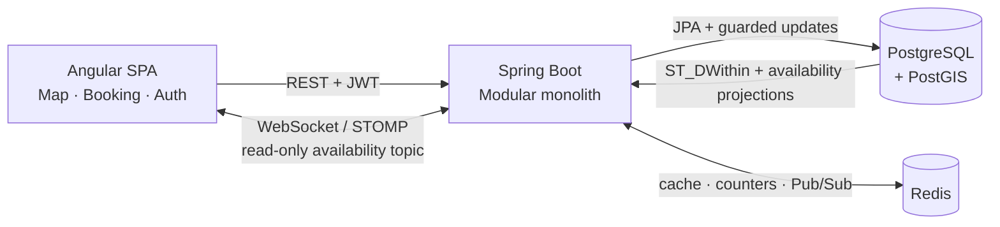

# System Overview

High-level view of Parking Finder's components, data flows, and security model.

---

## Components

| Layer | Technology | Role |
|-------|-----------|------|
| Frontend | Angular SPA, Leaflet, STOMP.js | Map-first UI, booking/auth flows, realtime state and recovery |
| Backend | Spring Boot modular monolith | REST API, transactions, scheduled jobs, WebSocket/STOMP fan-out |
| Database | PostgreSQL + PostGIS | Durable source of truth and geospatial search |
| Redis | Counters, projections, cache, Pub/Sub | Atomic admission, fast reads, and cross-instance realtime distribution |

---

## Architecture Diagram



PostgreSQL owns parking and booking state. Redis accelerates access and distribution but is never
authoritative.

---

## Backend Modules

### Parking

- Nearby search via PostGIS `ST_DWithin`
- Cached static metadata with fresh PostgreSQL availability overlays
- Parking detail with amenity flags and absolute slot counts

### Booking

- Create booking — Redis atomic admission → guarded PostgreSQL decrement → booking insert
- Booking history, active booking, and ownership-scoped detail/cancellation APIs
- Lifecycle scheduler — transitions PENDING → ACTIVE → COMPLETED/EXPIRED every 60 seconds
- Redis reservation compensation when the database transaction fails

### Realtime Availability

- Committed absolute `ParkingAvailabilityChanged` events
- Redis Pub/Sub channel `parking.availability.v1` for cross-instance fan-out
- Native `/ws` endpoint and public read-only `/topic/parking-availability` STOMP topic
- Admin-protected occupancy simulator for controlled `ENTER` and `EXIT` demo events
- Browser heartbeat, exponential reconnect, REST fallback polling, and reconnect resync

### Auth and User

- Register, login, refresh, logout, and current-user profile
- Short-lived JWT access token and persisted, revocable refresh token
- Admin simulator protected by JWT role; availability subscription remains public and read-only

---

## Security Model

Protected REST flow:

```text
Client
  → Authorization: Bearer <access_token>
  → JwtAuthFilter validates token and role claim
  → SecurityContext receives the principal
  → Controller/service applies ownership or role rules
```

WebSocket availability flow:

- The HTTP Origin must match the configured CORS allowlist.
- `CONNECT`, lifecycle frames, and the exact public subscription are allowed.
- Client `SEND`, wildcard subscriptions, and other destinations are rejected.

---

## Core Data Flows

### Nearby Parking

1. Angular requests `GET /parkings/nearby`.
2. Spring loads cached or database-backed parking metadata.
3. PostgreSQL supplies a batched current-availability projection.
4. The service overlays absolute slots and timestamps before responding.
5. Angular reconciles the response by `updatedAt` so an older request cannot replace a newer event.

### Booking or Occupancy Change

```text
Redis admission when required
  → guarded PostgreSQL update inside transaction
  → COMMIT
  → absolute application event
     ├─ synchronize Redis counter/snapshot and evict detail cache
     └─ publish Redis channel
         → subscriber on every backend instance
         → local STOMP broker
         → connected Angular clients
```

### Browser Recovery

```text
Connected       → apply validated absolute STOMP events
Unavailable     → poll authoritative nearby REST every 10 seconds
Reconnected     → immediate REST resync, then stop polling
Any input       → ignore values older than current updatedAt
```

Redis Pub/Sub has no replay. REST recovery is therefore part of the correctness model rather than
only a performance fallback.
